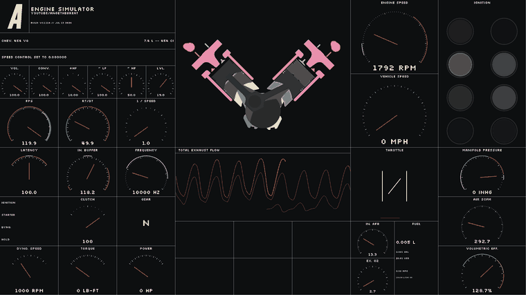
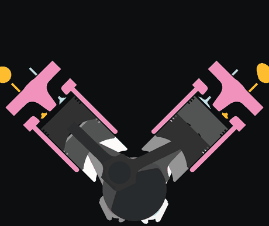
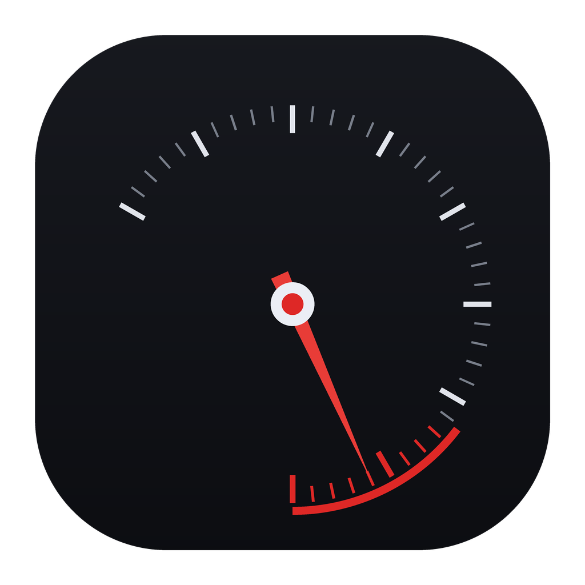
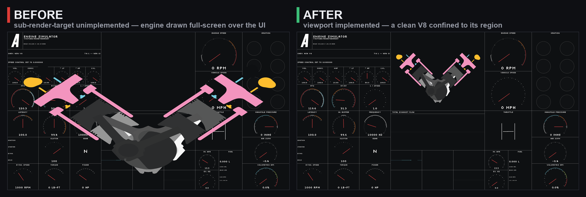
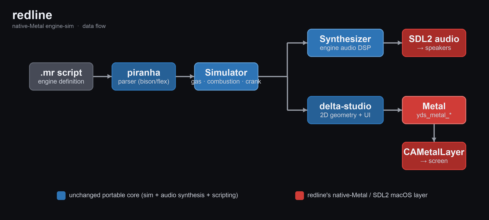

<div align="center">

# redline

### A native-Metal build of the real-time combustion-engine simulator, for Apple Silicon macOS.

[](https://github.com/cleoanka/redline/actions/workflows/macos.yml)
[](https://github.com/cleoanka/redline)
[-DE2827)](dependencies/submodules/delta-studio/src/yds_metal_device.cpp)
[](LICENSE)



*A Chevrolet 454 big-block, simulated in real time — pistons pumping, crank spinning, exhaust waveform dancing, gauges sweeping to redline. Rendered natively through Metal.*

</div>

---

## What is this?

[`engine-sim`](https://github.com/ange-yaghi/engine-sim) by **AngeTheGreat** is a real-time
internal-combustion-engine simulation that *generates its own engine audio* from a physical
model of the gas dynamics, combustion, and valvetrain — you build an engine in a small script
language and hear it idle, rev, and hit the limiter.

The catch: it only runs on **Windows**, through DirectX 11. `redline` brings it to **Apple
Silicon macOS** with a **native Metal renderer**, SDL2 for windowing/input/audio, a modern
2026 toolchain, the long-standing rendering bugs fixed, and a proper double-clickable `.app`.

<div align="center">

&nbsp;&nbsp;

</div>

> It's a toy for making engine sounds and exploring engine response — not a scientific
> engineering tool.

## Why this fork

A Metal port already existed — [boxofbox/engine-sim-APPLE_ARM](https://github.com/boxofbox/engine-sim-APPLE_ARM)
had done the hard work of writing a native Metal backend (`metal-cpp`) into engine-sim's
renderer, `delta-studio`. But it went dormant in early 2023: it no longer builds on a modern
macOS toolchain, and it shipped with three known rendering bugs. **`redline` revives it** —
builds on macOS 26 (Tahoe) / CMake 4 / Apple clang 21 / Boost 1.90, fixes the bugs, and
packages it as a real app.

### The headline fix

Two of the three bugs were HiDPI point-vs-pixel mistakes. The interesting one was the
*scrambled engine cross-section*: engine-sim renders the engine into a **sub-region** of the
screen (its own viewport) while the UI is drawn full-screen — but in the Metal backend the
sub-render-target functions were **stubs**, and `SetRenderTarget`'s signature didn't even match
the one the render loop calls. So the engine, projected for its little box, was drawn across the
whole screen, on top of the gauges. Implementing the viewport fixed it:

<div align="center">

</div>

## Architecture

The valuable core — the physics and the audio synthesis — is portable C++ and untouched.
`redline` only replaces the platform layer: the renderer (→ Metal) and windowing/audio (→ SDL2).

<div align="center">

</div>

## Build

```sh
# arm64 Homebrew (/opt/homebrew)
brew install cmake boost bison sse2neon sdl2 sdl2_image flex

git clone https://github.com/cleoanka/redline.git
cd redline
export PATH="/opt/homebrew/opt/bison/bin:/opt/homebrew/opt/flex/bin:/opt/homebrew/bin:$PATH"
cmake -B build -S . -DCMAKE_BUILD_TYPE=Release -DCMAKE_POLICY_VERSION_MINIMUM=3.5 -DDISCORD_ENABLED=OFF
cmake --build build --target engine-sim-app -j

cd build && ./engine-sim-app     # run from build/ so it finds ../assets
```

### Package as a double-clickable app

```sh
cmake --build build --target redline-app   # -> dist/redline.app
open dist/redline.app                       # or double-click it in Finder
```

## Controls

Minimal, keyboard-driven (unchanged from upstream):

| Key | Action | Key | Action |
| :--: | :-- | :--: | :-- |
| **A** | Toggle ignition | **S** | Hold for starter |
| **D** | Enable dyno | **H** | RPM hold (needs dyno) |
| **Q W E R** | Throttle presets | **Space** | Fine throttle (+scroll) |
| **↑ / ↓** | Shift gear up/down | **Shift** | Clutch |
| **Z/X/C/V/B** + scroll | Audio mix | **Tab** | Change screen |
| **M / ,** | View layer up/down | **Enter** | Reload engine script |
| **F** | Fullscreen | **Esc** | Quit |

<details>
<summary><b>Headless capture &amp; demo knobs</b> (how the GIFs above were made)</summary>

The macOS sandbox this was developed in has no Screen-Recording permission, so `redline`
grew a way to record itself — the app reads back its own Metal drawable:

| Env var | Effect |
| :-- | :-- |
| `REDLINE_CAPTURE=<path>` | dump a frame as raw BGRA8 (`int32 w, int32 h`, then pixels) |
| `REDLINE_CAPTURE_FRAME=<n>` | which single frame (default 90) |
| `REDLINE_CAPTURE_SEQ=start,stride,count` | dump a sequence → `<path>.000`, `.001`, … |
| `REDLINE_AUTORUN=1` | crank + rev the engine unattended (for demos / captures) |

All are no-ops unless set. The GIFs on this page are `REDLINE_AUTORUN=1` +
`REDLINE_CAPTURE_SEQ` assembled with Pillow.
</details>

## Credits & lineage

`redline` stands on a chain of open-source work — thank you to everyone in it:

- **[ange-yaghi/engine-sim](https://github.com/ange-yaghi/engine-sim)** — the original
  simulator and the `delta-studio` engine. © 2022 Ange Yaghi (MIT).
- **[phire/delta-studio @ clang_linux](https://github.com/phire/delta-studio/tree/clang_linux)**
  — DirectX→OpenGL, MSVC→clang.
- **[bobsayshilol/engine-sim @ gcc-fixes](https://github.com/bobsayshilol/engine-sim/tree/gcc-fixes)**
  — gcc/clang portability.
- **[boxofbox/engine-sim-APPLE_ARM](https://github.com/boxofbox/engine-sim-APPLE_ARM)**
  — the Apple-Silicon port with the native `metal-cpp` Metal backend redline continues.

See [`docs/DESIGN.md`](docs/DESIGN.md) · [`CHANGELOG.md`](CHANGELOG.md) ·
[`docs/METAL_BACKEND.md`](docs/METAL_BACKEND.md).

## License

MIT — see [`LICENSE`](LICENSE) and [`NOTICE`](NOTICE). Upstream copyright preserved.
